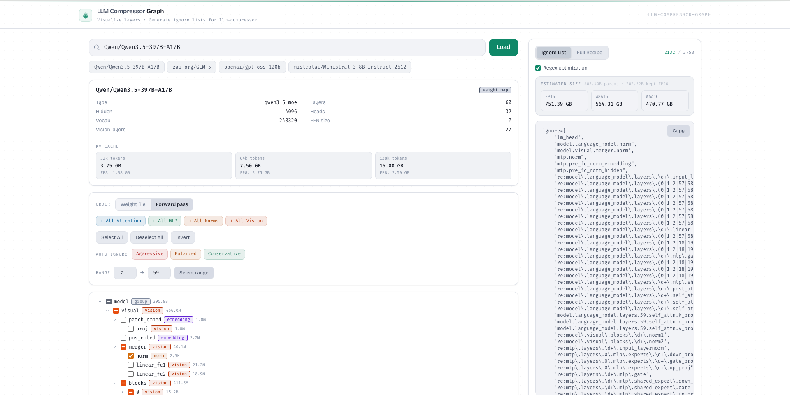

# LLM Compressor Graph

A browser-based interactive tool for **visualizing LLM architecture** and **generating quantization ignore lists** for [llm-compressor](https://github.com/vllm-project/llm-compressor). Fully client-side — no backend needed. Fetches model data directly from the Hugging Face Hub.

🌐 **[Try it online](https://llm-graph.float16.cloud)** — No installation required!

## ✨ Features

- **🔍 Load any Hugging Face model** — Enter any model ID (e.g., `meta-llama/Llama-3.1-8B`) and visualize its architecture instantly
  - Parses `model.safetensors.index.json` for exact layer structure
  - Falls back to `config.json` for known architectures (Llama, Qwen, Mistral, Phi3, GPT-NeoX, etc.)
  - Supports multimodal/vision-language models (detects vision encoders)
  - Supports hybrid attention models (e.g., Qwen3-Next with DeltaNet + full attention)

- **🌲 Hierarchical architecture tree** — Color-coded, collapsible tree view of all model modules
  - Layer type badges: Attention (blue), MLP (green), Norm (amber), Embedding (purple), Head (red), Vision (orange)
  - Per-module parameter counts (fetched via HTTP Range requests on safetensors headers)
  - Two sort orders: "Weight file" (original) or "Forward pass" (embedding → layers → head)

- **🎯 Smart selection tools**
  - Select/deselect by layer type (All Attention, All MLP, All Norms, All Vision)
  - Layer range selector (layers N through M)
  - **Auto-ignore presets**: Aggressive (most compression), Balanced (recommended), Conservative (best quality)
  - Checkbox tri-state with group selection

- **📋 Output generation**
  - **Ignore List**: Plain Python `ignore=[...]` list
  - **Full Recipe**: Complete `llm-compressor` Python code snippet with:
    - Configurable modifier: GPTQ, QuantizationModifier, SmoothQuant
    - Configurable scheme: W4A16, W8A16, FP8, FP8_BLOCK
    - Optional KV cache quantization (FP8/INT8, per-tensor/per-head)
  - **Regex optimization**: Collapses repeated layer patterns (e.g., `re:model\.layers\.\d+\.mlp\.gate_proj`)
  - Editable output with Apply/Reset
  - One-click copy to clipboard

- **📊 Size estimation**
  - KV cache memory estimates at 32k/64k/128k context lengths (FP16 and FP8)
  - Quantized model size estimates (FP16, W8A16, W4A16) accounting for ignored layers

- **💾 Export**
  - Export architecture tree as high-DPI PNG (2x resolution) with model name header

## 🚀 Getting Started

```bash
# Install dependencies
npm install

# Start dev server
npm run dev

# Build for production
npm run build

# Preview production build
npm run preview
```

**No backend or environment variables needed.** The app runs entirely in your browser.

## 🛠️ Tech Stack

- **React 19** with TypeScript
- **Vite 7** for build tooling
- **Tailwind CSS 4** for styling
- **Zustand** for state management
- **html-to-image** for PNG export

## 🤝 Contributing

We welcome contributions! This is an open source project.

### How to contribute

1. **Fork** the repository
2. **Create a branch** for your feature (`git checkout -b feature/amazing-feature`)
3. **Commit your changes** (`git commit -m 'Add amazing feature'`)
4. **Push to your branch** (`git push origin feature/amazing-feature`)
5. **Open a Pull Request**

### Ideas for contributions

- Support for additional model architectures
- More auto-ignore presets based on empirical research
- UI/UX improvements
- Performance optimizations
- Bug fixes

**Issues and feature requests welcome!** Check out the [GitHub Issues](https://github.com/float16-cloud/llm-compressor-graph/issues).

## 🔗 Links

- **GitHub**: [float16-cloud/llm-compressor-graph](https://github.com/float16-cloud/llm-compressor-graph)
- **llm-compressor**: [vllm-project/llm-compressor](https://github.com/vllm-project/llm-compressor)
- **vLLM**: [vllm-project/vllm](https://github.com/vllm-project/vllm)

## 📄 License

This project is licensed under the Apache License 2.0 - see the [LICENSE](LICENSE) file for details.

---

Built with 💚 by the [float16.cloud](https://github.com/float16-cloud) team
